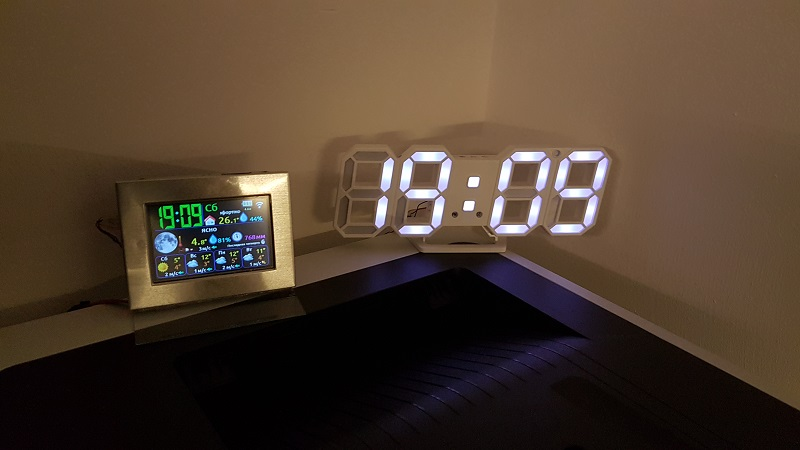
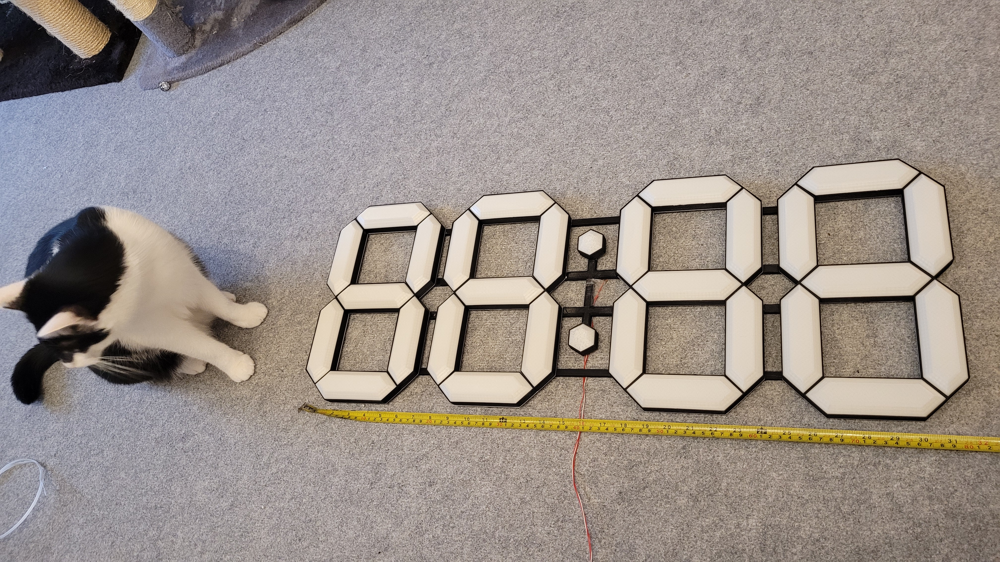
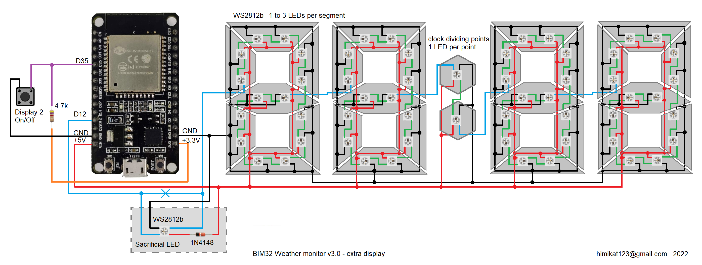

## Схема дополнительного 7-сегментного дисплея
Дополнительный 7-сегментный цветной дисплей на пиксельных светодиодах WS2812b. Изначально я купил небольшие часы на Алиэкспресс, вынул из них все внутренности и смонтировал вместо них пиксельные светодиоды. 

В дальнейшем захотелось дисплей побольше и я напечатал его на 3d принтере. Получились довольно немаленькие часики размерами 30 х 80 см.

Схема соединения светодиодов показана на рисунке ниже. Нужно соединить все светодиоды последовательно, от 1 до 3 шт. на сегмент, в разделительных точках по одному светодиоду. В настройках можно выбрать количество светодиодов в сегменте. Некоторые партии светодиодов WS2812b отлично работают при входных уровнях управляющих импульсов в 3.3в, но в большинстве случаев работать они так не будут, поэтому может понадобиться преобразователь уровней сигналов. Самый простой способ - пожертвовать один такой светодиод на преобразователь. На схеме "жертвенный светодиод" обведен штрих-линией. Также стоит отметить что большое количество светодиодов WS2812b может потреблять значительный ток, для простоты расчета мощности блока питания, на странице настроек будет показан максимальный ток потребления дисплея для текущих настроек.

