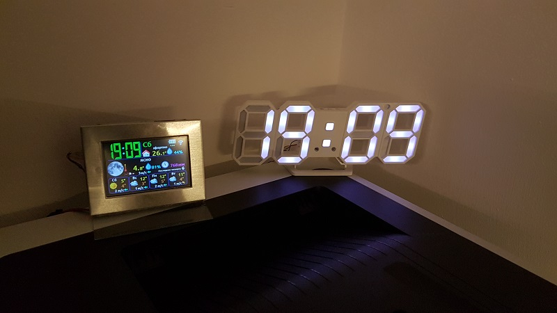
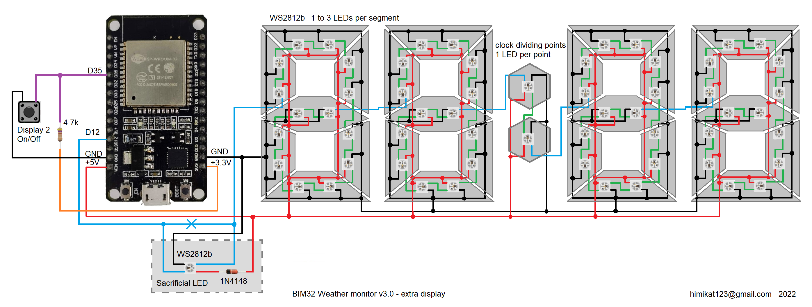

## Schematic of optional 7-segment display
Optional WS2812b pixel LED 7-segment color display. Initially, I bought a small clock from Aliexpress, took out all the insides and mounted pixel LEDs instead.

In the future, I wanted a larger display and I printed it on a 3d printer. It turned out to be a rather rather big watch measuring 30 x 80 cm.

The LED connection diagram is shown in the figure below. It is necessary to connect all the LEDs in series, from 1 to 3 pcs. per segment, at the dividing points, one LED each. In the settings, you can select the number of LEDs in the segment. Some batches of WS2812b LEDs work fine with 3.3V input levels, but in most cases they won't work that way, so a signal level converter may be needed. The easiest way is to donate one such LED to the converter. In the diagram, the "sacrificial LED" is circled with a dashed line. It is also worth noting that a large number of WS2812b LEDs can consume significant current, for ease of calculating the power supply capacity, the settings page will show the maximum current consumption of the display for the current settings.

