<a href="README.md"></a>
<a href="README_RU.md"></a>

# BIM32 weather monitor
## Weather monitor on ESP32

<p align="center"></p>

<p align="center"></p>

### Brief list of weather monitor features:

* Connect to home WiFi network 2.4 GHz
* Display current weather and weather forecast for 3 days
* Display hourly weather forecast for 5 days
* Display weather history (hourly) for 1 day ago
* Charts building (temperature, humidity, pressure and precipitation probability)
* Display temperature and humidity in the house
* Home weather control (humidifier, dehumidifier, heater and cooler)
* Clock (small/large/with seconds/analog) with NTP synchronization
* Calendar with the ability to scroll up to plus/minus infinity
* Sending and/or receiving data from/to thingspeak
* Sending data to narodmon
* Up to 2 wireless temperature/pressure/humidity/ambient light/voltage/current/power/energy sensors
* Support wired temperature/pressure/humidity/ambient light sensors
* Auto-adjust the brightness of the screen backlight (by ambient light sensor, by time or by the fact of sunrise and sunset)
* 3.5 inch color touch display
* Support 5 languages: English, German, Russian, Polish, Ukrainian
* Optional 7-segment color display of large and even huge clocks
* Talking clock
* Alarm clock playing mp3 files
* Very flexible settings via web interface

## Wiring diagram for base weather monitor modules
To start and operate the weather monitor, just connect **display** to **ESP32**. Connecting all other modules is optional.

Instead of diagrams, I post half-drawings, half-photos, so that it is clear to beginners and even non-professionals. I ask professionals not to be upset, normal schematic diagramms will also be.

<p align="center">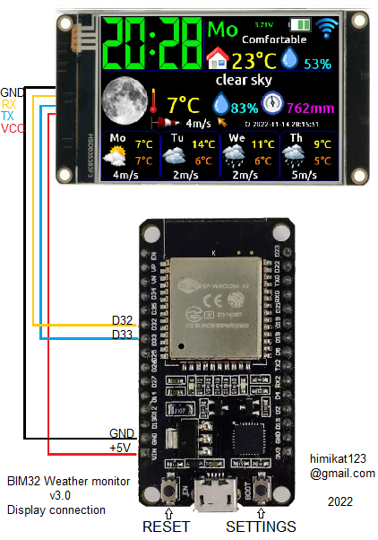</p>

You can use the extended **Nextion** display **NX4832K035**, or the basic **NX4832T035**. In the case of the base model, you will not have access to the clock with seconds, and when turned on, the display clock will not show the correct time until the **weather monitor** synchronizes the clock with the **NTP server**.

If anyone need to have a display on/off button at hand, it can be connected according to the following scheme.

<p align="center">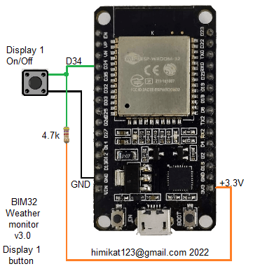</p>

## Scheme of connecting wired sensors to the weather monitor
To the **weather monitor** can be connected to wired sensors for temperature, humidity, pressure and ambient light. **The monitor** supports the following sensors:
* BME280
* BMP180
* SHT21
* DHT22
* DS18B20
* MAX44009
* BH1750
* photoresistor

You can connect any one, several, or all sensors from this list at once. The connection diagram is as follows.

<p align="center">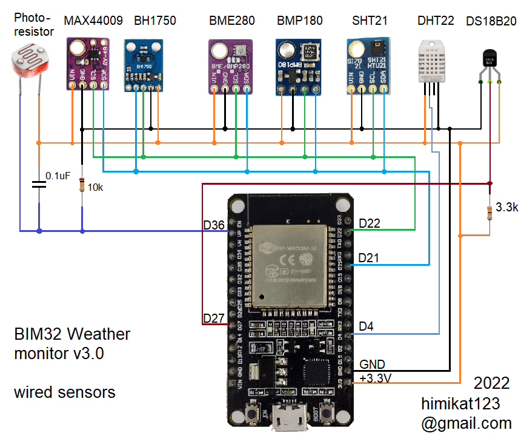</p>

## Wiring diagram of the radio channel module for communication with wireless sensors
Also, **[wireless sensors](https://github.com/himikat123/Radio-sensor)** can be connected to the **weather monitor**, for this you need to add the radio channel module **HC-12** according to the diagram below.

<p align="center">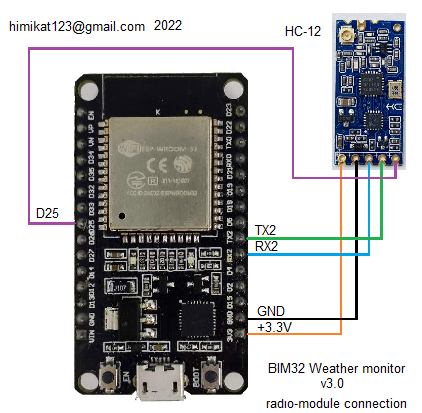</p>

## Wiring diagram for weather control devices in the house
To control the weather in your home, you can connect a humidifier and dehumidifier, as well as a heater and cooler. I can’t give a connection diagram for these devices, since it all depends on how the control is implemented in each specific device (remote control, buttons, voltage). Therefore, I will simply indicate on which outputs of **ESP32** logical units will appear when it needs to turn on this or that device.

<p align="center">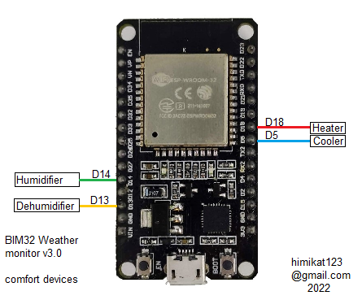</p>

## Sound module connection diagram
In order for the alarm clock and the talking clock to make sounds, the **DF-Player mini** mp3 player module is used, the connection diagram of which is presented below. You will need to copy the **02** folder to the **micro-sd card** from the **SDcard** folder and the **01** folder from the folder corresponding to your language, from the same folder. As a result, there should be 2 folders on the **micro-sd card**: **01** - with clock voice files and **02** - with sounds and alarm melodies.

<p align="center">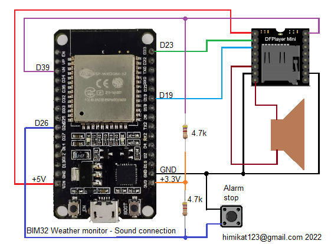</p>

## Optional 7-segment display
As an option, **[additional 7-segment color display](/7segment_display/README.md) can be connected to the **weather monitor**.**

<p align="center">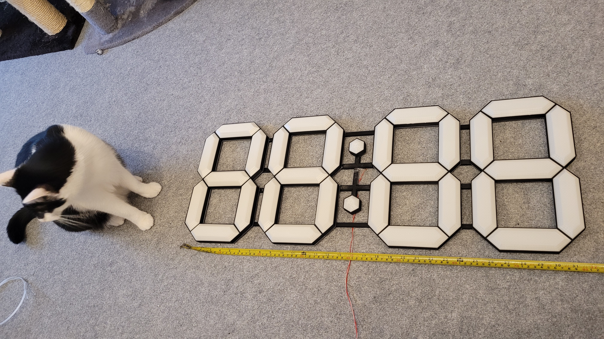</p>

## Weather monitor circuit

Well, as promised, a normal general schematic diagramm for general development. 

```diff 
- Please note if you choose not to install buttons 
- (turn on/off displays and turn off alarms), 
- pull-up resistors R1, R2 and R3 are still needed.
```

<p align="center"></p>

## Weather monitor firmware

To flash the weather monitor, you will need a **micro-sd** card, **micro-USB** cable and a computer.

To flash a **display**, you need to copy the display firmware file (the file with the model name of your display .tft) from the **bin** folder to the **micro-sd** card (the card must be formatted in the **FAT32 file system**). Then insert the **micro-sd card** into the **micro-sd** slot of the display and power it up. The display itself will be flashed from the flash drive, the progress of the firmware will be displayed on the screen.

To flash **ESP32**:
1. Add **ESP32** support to **Arduino IDE**, find [instruction](https://www.google.ru/search?q=arduino+ide+installing+esp32&newwindow=1&sxsrf=ALiCzsbDLg54nE9Dbm382-Jn26gRGqRdDA%3A1672595667576&ei=08ixY5rgIsCFxc8P2eSyuAE&ved=0ahUKEwjalfm0-Kb8AhXAQvEDHVmyDBcQ4dUDCBA&uact=5&oq=arduino+ide+installing+esp32&gs_lcp=Cgxnd3Mtd2l6LXNlcnAQAzIGCAAQCBAeMgYIABAIEB4yBggAEAgQHjIGCAAQCBAeMgkIABAIEB4Q8QQ6CggAEEcQ1gQQsAM6BwgAELADEEM6BwgjELACECc6BggAEAcQHjoHCAAQgAQQDToICAAQCBAHEB46CwgAEAgQBxAeEPEEOggIABAHEB4QEzoKCAAQCBAHEB4QEzoNCAAQCBAHEB4Q8QQQEzoICAAQCBAeEA1KBAhBGABKBAhGGABQ-AdYiBhg9BpoAXABeACAAbABiAGTCJIBBDEwLjGYAQCgAQHIAQrAAQE&sclient=gws-wiz-serp)
2. Add to **Arduino** plug-in for filling **SPIFFS** find [instruction](https://www.google.ru/search?q=esp32+sketch+data+upload+tool&newwindow=1&sxsrf=ALiCzsZ5JftMwAL465WEznVc7qxgQslq3g%3A1672595724155&ei=DMmxY8_9CLWGxc8PiLOIsAw&oq=esp32+sketch+data+upload+&gs_lcp=Cgxnd3Mtd2l6LXNlcnAQAxgCMggIABCABBDLATIICAAQgAQQywEyCAgAEIAEEMsBMggIABCABBDLATIICAAQgAQQywEyCAgAEIAEEMsBMggIABCABBDLATIGCAAQFhAeMgYIABAWEB4yBggAEBYQHjoKCAAQRxDWBBCwAzoGCAAQBxAeOgUIABCABDoGCAAQCBAeOggIABAIEAcQHjoICCEQwwQQoAE6CgghEMMEEAoQoAE6BQgAEKIESgQIQRgASgQIRhgAUMQGWMFBYPJTaAFwAXgAgAF8iAHyB5IBAzYuNJgBAKABAcgBCMABAQ&sclient=gws-wiz-serp)
3. Unpack the libraries from the file **libraries.zip** to the folder `C:/Users/Username/Documents/Arduino/libraries`
4. Open the `C:/Users/Username/AppData/Local/Arduino15/packages/esp32/hardware/esp32/1.0.5/platform.txt` and find the line
`compiler.elf2hex.extra_flags=`, add new line: `compiler.libraries.ldflags=`

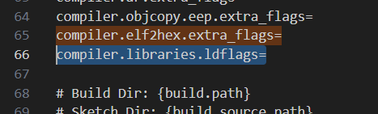

Then in the same file find `{compiler.c.elf.libs}` and add after it, to the same line: `{compiler.libraries.ldflags}`

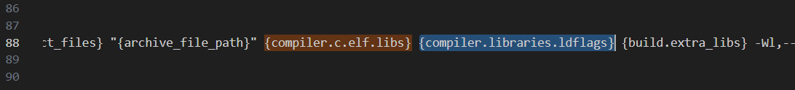

5. Flash the board with a sketch
6. Flash the files of the **SPIFFS** file system, in Arduino you need to select **Tools --> ESP32 Sketch Data Upload**

After the flashing **the weather monitor** needs to be configured. An unconfigured device turns on the access point (creates a WiFi network) **Weather monitor BIM32** with the default network password **1234567890**. And in the future, to turn it on again, you need to press and hold the **Settings** button until the access point symbol appears on the screen instead of the antenna symbol. After connecting a laptop or phone to the **Weather monitor BIM32** network, open a browser and navigate to **http://192.168.4.1**. Enter login **admin** and password **1111** to open the settings page. In the future, for security reasons, it is recommended to change the default password.

<p align="center">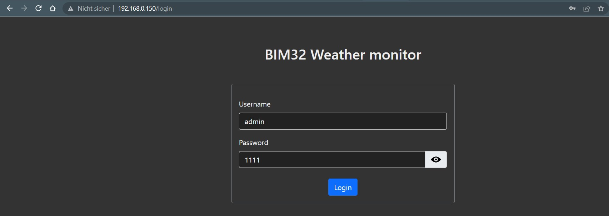</p>

Also, when the device is already configured and connected to the network, you can get into the settings without pressing the **Settings** button, just enter the IP address of the **weather monitor** in the browser. You can find out this address by tapping on the antenna symbol on the screen of the **weather monitor**.

<p align="center">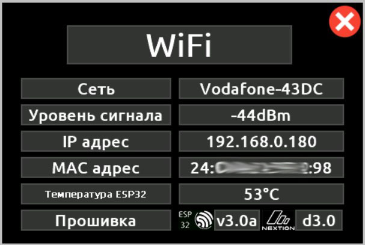</p><hr />

## A demo of the settings page can be viewed <a href="https://bim32demo.000webhostapp.com/" target="_blank">here</a><hr />

## Photos of the weather monitor
Well, in the end, traditionally a few pictures of the resulting device. The case is printed on a 3D printer and consists of nine parts: the case itself, the back wall, the micro-sd card cover, buttons and five board holders.

<p align="center">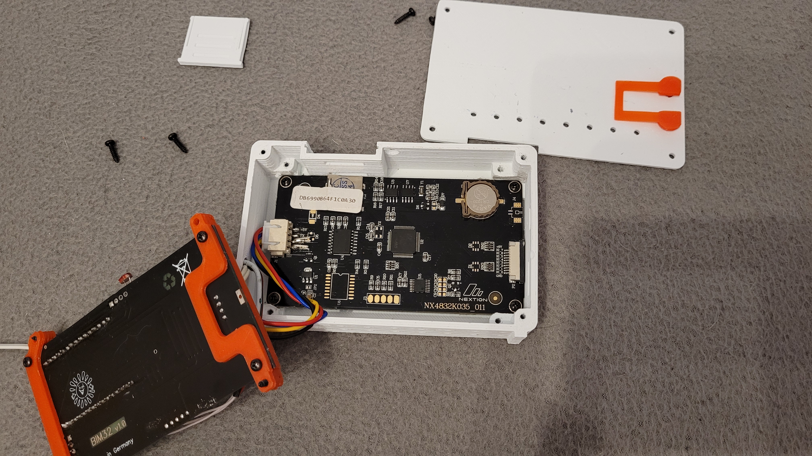</p>

<p align="center">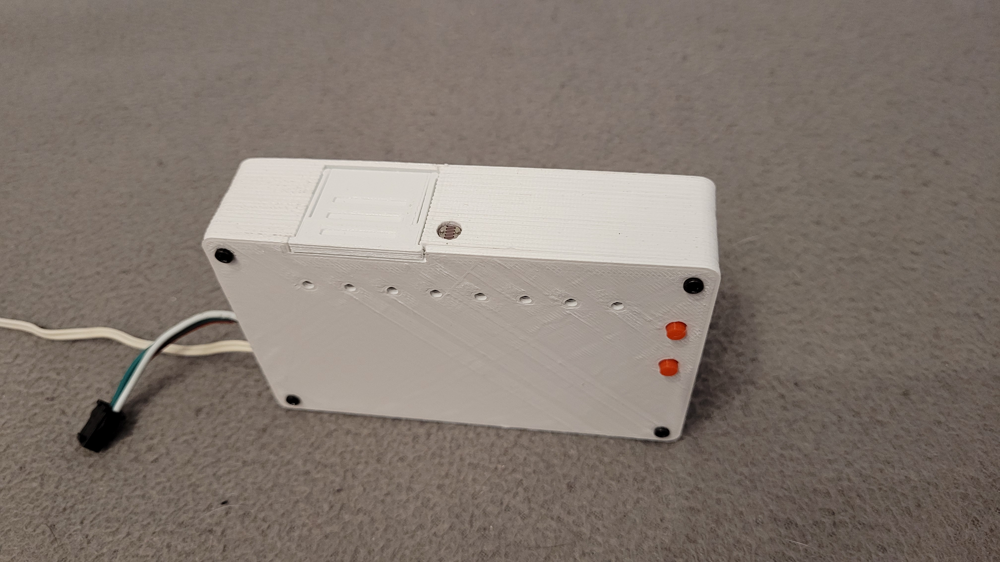</p>

<p align="center">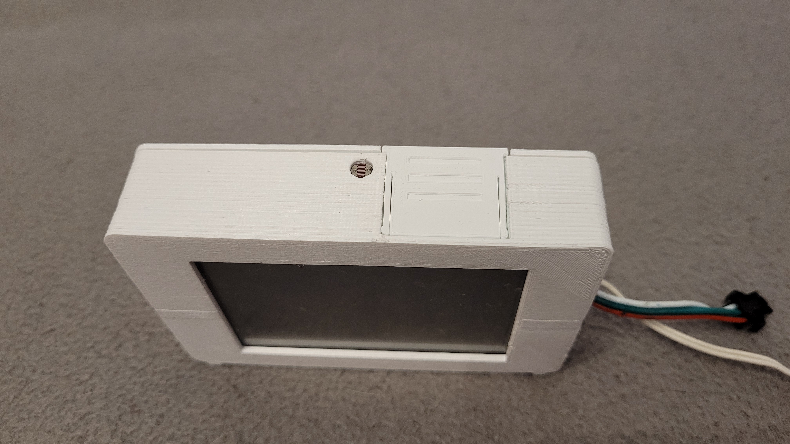</p>

<p align="center">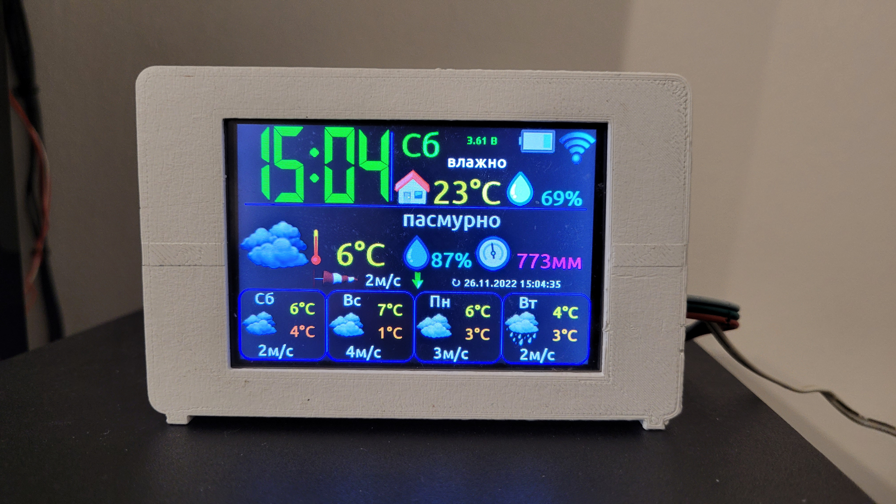</p>

<p align="center"></p>

<hr>


## Do you like the project? Buy me coffee or beer.

<a href="https://www.buymeacoffee.com/himikat123Q">
    
</a>

<a href="https://www.paypal.com/donate/?hosted_button_id=R4QDCRKTC9QA6">
    
</a>