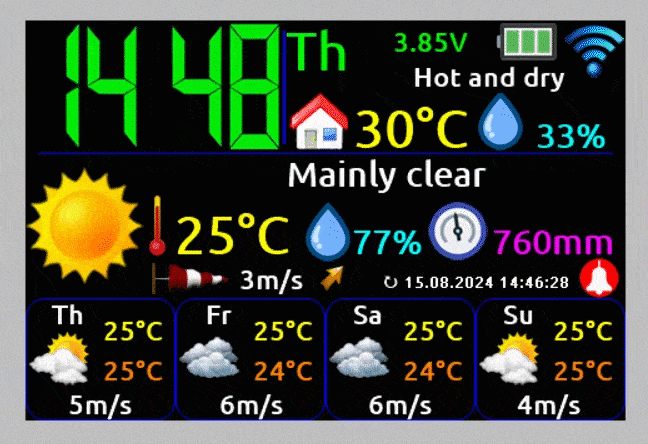
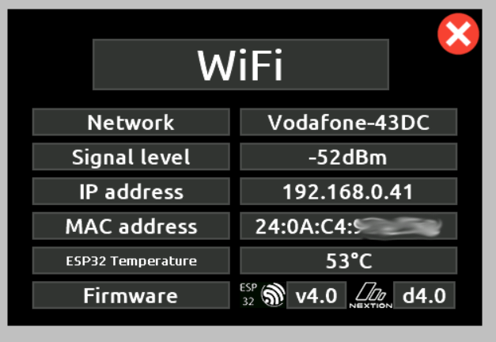

<a href="README.md"></a>
<a href="README_RU.md"></a>

# BIM32 weather monitor
## Weather monitor on ESP32

<p align="center"></p>

### Brief list of weather monitor features:

* Connect to home WiFi network 2.4 GHz
* Display current weather and weather forecast for 3 days
* Display hourly weather forecast for 5 days
* Display weather history (hourly) for 1 day ago
* Charts building (temperature, humidity, pressure and precipitation probability)
* Display Temperature, Humidity, CO2 and Index of Air Quality in the house
* Home weather control (Humidifier, Dehumidifier, Heater, Cooler and Purifier)
* Clock (Small/Large/With seconds/Analog) with NTP synchronization
* Calendar with the ability to scroll up to plus/minus infinity
* Sending and/or receiving data from/to thingspeak
* Sending data to narodmon
* Up to 2 wireless Temperature/Pressure/Humidity/CO2/ambient light/voltage/current/power/energy sensors
* Support wired Temperature/Pressure/Humidity/Index of Air Quality/Ambient light sensors
* Auto-adjust the brightness of the screen backlight (by ambient light sensor, by time or by the fact of sunrise and sunset)
* 3.5 or 3.2 inch color touch display
* Support 6 languages: English, German, Russian, Polish, Ukrainian, Bulgarian
* Optional 7-segment color display of large and even huge clocks
* Talking clock
* Alarm clock playing mp3 files
* Sound alert when Temperature, Humidity, CO2 and Air Quality go beyond comfort limits
* Very flexible settings via web interface

## Wiring diagram for base weather monitor modules
To start and operate the weather monitor, just connect **display** to **ESP32**. Connecting all other modules is optional.

Instead of schematic diagrams, I post half-drawings, half-photos, so that it is clear to beginners and even non-professionals. I ask professionals not to be upset, normal schematic diagrams will also be.

<p align="center"></p>

You can use the extended version of the **Nextion** display **NX4832K035**, or the basic **NX4832T035**. In the case of the basic model, you will not have access to the clock with seconds, weather graphs, and alarm control from the screen.

Alternatively, you can use the ILI9341 display.

<p align="center"></p>

If anyone need to have a display on/off button at hand, it can be connected according to the following scheme.

<p align="center"></p>

## Wiring diagram of connecting wired sensors to the weather monitor
To the **weather monitor** can be connected wired sensors for temperature, humidity, pressure, index of air quality and ambient light. **The monitor** supports the following sensors:
* BME280
* BME680
* BMP180
* SHT21
* DHT22
* DS18B20
* MAX44009
* BH1750
* photoresistor

You can connect any one, several, or all sensors from this list at once. If your display is not **NX4832K035** it is recommended to install the DS3231 real time clock chip. The connection diagram is as follows.

<p align="center"></p>

## Wiring diagram of the radio channel module for communication with wireless sensors
Also, **[wireless sensors](https://github.com/himikat123/Radio-sensor)** can be connected to the **weather monitor**, for this you need to add the radio channel module **HC-12** according to the diagram below.

<p align="center"></p>

## Wiring diagram for weather control devices in the house
To control the weather in the house, you can connect a humidifier and dehumidifier, as well as a heater, cooler (fan or air conditioner) and air purifier. I cannot provide a connection diagram for these devices, since everything depends on how the control is implemented in each specific device (remote control, buttons, voltage). Therefore, I will simply indicate on which pins of **PCF8574** logical signals will appear when need to turn on this or that device.

<p align="center"></p>

## Sound module connection diagram
To enable the alarm clock and the talking clock to produce sounds, the **DF-Player mini** mp3 player module is used, the connection diagram for which is shown below. You will need to copy the entire contents of the **SDcard** folder to the **micro-sd card**, having previously formatted it in the FAT32 file system. If you do not need sound, just connect the GPIO18 ESP32 pin to ground.

<p align="center"></p>

Having used this device, an unpleasant moment was discovered: this mp3 player module produces a constant low noise. To get rid of the noise, you need to re-solder the resistor from position A to position B, shown in the photo below. This manipulation switches the MUTE input of the amplifier to the BUSY output, on which a log. signal appears only during sound playback.

<p align="center"></p>

## Weather monitor circuit

Well, as promised, a normal general schematic diagramm for general development. 

```diff 
- Please note if you choose not to install buttons 
- (turn on/off displays and turn off alarms), 
- the pull-up resistors of these buttons still need to be installed.
```

<p align="center"></p>

## Weather monitor flashing
To flash the weather monitor, you will need a **micro-sd** card, a **micro-USB** cable and a computer.

To flash the **Nextion display**, you need to copy the display firmware file (a file with the model name of your display .tft) from the **bin** folder to the **micro-sd** card (the card must be formatted in the **FAT32** file system). Then insert the flash drive into the **micro-sd** slot of the display and supply it with power. The display will flash itself from the flash drive, the flashing progress will be displayed on the screen.

To flash **ESP32**:
1. Download [flash_download_tools](https://www.google.ru/search?q=flash_download_tools)
2. Run it, select ESP32 DownloadTool
3. Select the firmware binaries (located in the bin folder) and the addresses as in the screenshot. And the COM port number
4. Press the Start button in the flashing program and the Settings button on the device (the BOOT button on the ESP32 module). Keep the Settings button pressed until the flashing process starts.

<p align="center"></p>

After the flashing **the weather monitor** needs to be configured. An unconfigured device turns on the access point (creates a WiFi network) **BIM32** with the default network password **1234567890**. And in the future, to turn it on again, you need to press and hold the **Settings** button until the access point symbol appears on the screen instead of the antenna symbol. After connecting a laptop or smartphone to the **BIM32** network, open a browser and navigate to **http://192.168.4.1**. Enter login **admin** and password **1111** to open the settings page. In the future, for security reasons, it is recommended to change the default login and password.

<p align="center"></p>

Also, when the device is already configured and connected to the network, you can get into the settings without pressing the **Settings** button, just enter the IP address of the **weather monitor** in the browser. You can find out this address by tapping on the antenna symbol on the screen of the **weather monitor**.

<p align="center"></p><hr />

## A demo of the settings page can be viewed <a href="https://himikat123.github.io/Web-Interface-BIM/" target="_blank">here</a>

## Photos of the weather monitor
Well, and finally traditionally a few photos of the resulting device. The case is printed on a 3D printer, you will find the files for 3D printing in the **enclosure/STL/** folder.

<p align="center"></p>

<hr>


## Do you like the project? Buy me coffee or beer.

<a href="https://www.buymeacoffee.com/himikat123Q">
    
</a>

<a href="https://www.paypal.com/donate/?hosted_button_id=R4QDCRKTC9QA6">
    
</a>