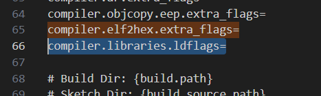
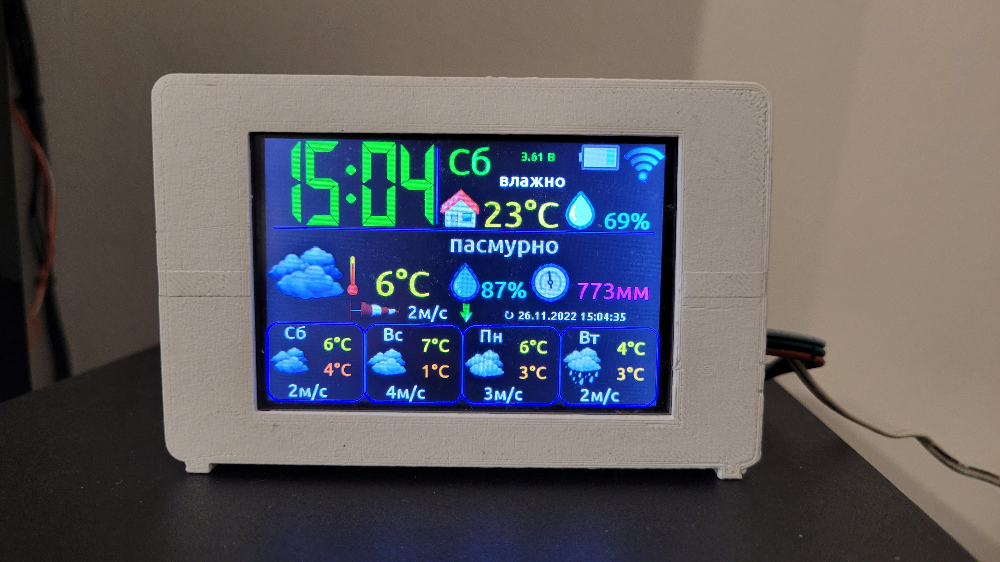

<a href="README.md"></a>
<a href="README_RU.md"></a> 

# Монитор погоды BIM32
## Монитор погоды на ESP32

<p align="center"></p> 

<p align="center"></p> 

### Краткий список возможностей монитора погоды:

* Подключение к домашней WiFi сети 2.4 гГц
* Отображение текущей погоды и прогноза погоды на 3 дня
* Отображение почасового прогноза погоды на 5 дней
* Отображение истории погоды (почасово) на 1 день назад
* Построение графиков температуры, влажности, давления и вероятности осадков
* Отображение температуры и влажности в доме
* Управление погодой в доме (увлажнителем, осушителем, обогревателем и охладителем)
* Часы (маленькие/большие/с секундами/стрелочные) с синхронизацией NTP
* Календарь с возможностью перелистывания до плюс/минус бесконечности
* Отправка и/или прием данных с/на сервис thingspeak
* Отправка данных на народный мониторинг
* До 2х беспроводных датчиков температуры/давления/влажности/освещенности/напряжения/тока/мощности/потребленной энергии
* Поддержка проводных датчиков температуры/давления/влажности/освещенности
* Авторегулировка яркости подсветки экрана (по датчику освещенности, по времени или по факту рассвета и заката)
* Цветной сенсорный дисплей 3,5 дюйма
* Поддержка 5 языков: Английский, Немецкий, Русский, Польский, Украинский
* Дополнительный 7-сегментный цветной дисплей больших и даже огромных часов
* Говорящие часы
* Будильник воспроизводящий mp3 файлы
* Очень гибкие настройки через веб интерфейс

## Схема подключения базовых модулей монитора погоды
Для запуска и работы монитора погоды достаточно соединить **дисплей** с **ESP32**. Подключение всех остальных модулей является необязательным. 

Выкладываю вместо схем полурисунки-полуфотографии, чтоб было понятно и начинающим и даже непрофессионалам. Профессионалов прошу не расстраиваться, нормальные схемы тоже будут.

<p align="center"></p>

Можно применить расширенную версию **Nextion** дисплея **NX4832K035**, или базовую **NX4832T035**. В случае с базовой моделью вам не будут доступны часы с секундами, а также при включении на часах дисплея не будет отображаться правильное время, пока **монитор погоды** не синхронизирует часы с **NTP-сервером**.

Если вдруг, кому нужно иметь под рукой кнопку включения/выключения дисплея, ее можно подключить по следующей схеме.

<p align="center"></p>

## Схема подключения проводных датчиков к монитору погоды
К **монитору погоды** можно подключить проводные датчики температуры, влажности, давления и уровня освещенности. **Монитор** поддерживает следующие датчики: 
* BME280
* BMP180
* SHT21
* DHT22
* DS18B20
* MAX44009
* BH1750
* фоторезистор

Можно подключить любой один, несколько, либо сразу все датчики из этого списка. Схема подключения следующая.

<p align="center"></p>

## Схема подключения модуля радиоканала для связи с беспроводными датчиками
Также, к **монитору погоды** можно подключить **[беспроводные датчики](https://github.com/himikat123/Radio-sensor)**, для этого нужно добавить модуль радиоканала **HC-12** по схеме приведенной ниже.

<p align="center"></p>

## Схема подключения приборов управления погодой в доме
Для управления погодой в доме можно подключить увлажнитель и осушитель воздуха, а также обогреватель и охладитель. Схему подключения этих приборов привести не могу, так как все зависит от того как реализовано управление в каждом конкретном приборе (пультом, кнопками, напряжением). Поэтому просто обозначу на каких выводах **ESP32** появятся логические единицы когда нужно включить тот или иной прибор.

<p align="center"></p>

## Схема подключения модуля звука
Чтоб будильник и говорящие часы могли издавать звуки, применен модуль mp3-плеера **DF-Player mini**, схема подключения которого представлена ниже. Необходимо будет скопировать папку **02** на **micro-sd карту** из папки **SDcard** и папку **01** из папки соответствующей вашему языку, из той же папки. На итог, на **micro-sd карте** должны быть 2 папки: **01** - с файлами озвучки часов и **02** - со звуками и мелодиями будильников.

<p align="center"></p>

## Дополнительный 7-сегментный дисплей
В качестве дополнения, к **монитору погоды** можно подключить **[дополнительный 7-сегментный цветной дисплей](/7segment_display/README_RU.md).**

<p align="center"></p>

## Схема монитора погоды

Ну и, как и обещал, нормальная общая схема для общего развития.
```diff 
- Обратите внимание, если вы решите не устанавливать кнопки 
- (включения/отключения дисплеев и отключения будильника), 
- подтягивающие резисторы R1, R2 и R3 все равно нужны.
```

<p align="center"></p>

## Прошивка монитора погоды

Для прошивки монитора погоды вам понадобится **micro-sd** карта, **micro-USB** кабель и компьютер.

Чтоб прошить **дисплей**, нужно скопировать файл прошивки дисплея (файл с названием модели вашего дисплея .tft) из папки **bin** на **micro-sd** карту (карта должна быть отформатирована в файловой системе **FAT32**). Затем вставить флешку в слот **micro-sd** дисплея и подать ему питание. Дисплей сам прошьется с флешки, прогресс прошивки будет отображен на экране.

Для прошивки **ESP32**:
1. Добавляем в **Arduino IDE** поддержку **ESP32**, находим [инструкцию](https://www.google.ru/search?newwindow=1&sxsrf=ALeKk01SY0YVvecPGZL1p6_dmI2_zcbuzQ%3A1604686083566&ei=A5GlX-mXIoeckwX0lbiYCw&q=esp32+arduino+ide+%D1%83%D1%81%D1%82%D0%B0%D0%BD%D0%BE%D0%B2%D0%BA%D0%B0&oq=arduino+%D1%83%D1%81%D1%82esp32&gs_lcp=CgZwc3ktYWIQAxgAMggIABAIEAcQHjoECAAQRzoHCCMQsAIQJzoECAAQDToECCMQJzoFCAAQywE6BggAEAcQHlDcpgFY89oBYPzmAWgAcAJ4AIABb4gBzwaSAQM2LjOYAQCgAQGqAQdnd3Mtd2l6yAEIwAEB&sclient=psy-ab)
2. Добавляем в **Ардуино** плагин для заливки **SPIFFS** находим [инструкцию](https://www.google.ru/search?newwindow=1&sxsrf=ALeKk01Btxvm4RWeH8qgpglopKEEPCEwiw%3A1604686179645&ei=Y5GlX_bkJsHUkwXEqpSICg&q=esp32+arduino+%D1%83%D1%81%D1%82%D0%B0%D0%BD%D0%BE%D0%B2%D0%BA%D0%B0+sketch+upload&oq=esp32+arduino+%D1%83%D1%81%D1%82%D0%B0%D0%BD%D0%BE%D0%B2%D0%BA%D0%B0+sketch+upload&gs_lcp=CgZwc3ktYWIQAzoECAAQRzoHCCMQsAIQJzoICAAQCBANEB46BAgjECc6BggAEAgQHlC7Slj5dGDdeWgGcAJ4AIABiAGIAa0LkgEDNy43mAEAoAEBqgEHZ3dzLXdpesgBCMABAQ&sclient=psy-ab&ved=0ahUKEwi2otrtwe7sAhVB6qQKHUQVBaEQ4dUDCA0&uact=5)
3. Распаковываем библиотеки из файла **libraries.zip** в папку `C:/Users/Username/Documents/Arduino/libraries`
4. Открываем файл `C:/Users/Username/AppData/Local/Arduino15/packages/esp32/hardware/esp32/1.0.5/platform.txt` и находим (поиском) строчку
`compiler.elf2hex.extra_flags=`, добавьте новую строку: `compiler.libraries.ldflags=`



Потом, в этом же файле, находим `{compiler.c.elf.libs}` и добавляем за ним, в ту же строку: `{compiler.libraries.ldflags}`


5. Прошиваем плату скетчем
6. Прошиваем файлы файловой системы **SPIFFS**, в Ардуино нужно выбрать **Инструмены --> ESP32 Sketch Data Upload**

После прошивки **монитор погоды** нужно настроить. Ненастроенный прибор сам включает точку доступа (создает WiFi сеть) **Weather monitor BIM32** с паролем сети по умолчанию **1234567890**. А в дальнейшем, чтоб ее снова включить, нужно нажать и удерживать нажатой кнопку **Settings**, пока на экране вместо символа антенны не появится символ точки доступа. Подключив ноутбук или телефон к сети **Weather monitor BIM32** нужно открыть браузер и перейти по адресу **http://192.168.4.1**. Введите логин **admin** и пароль **1111** чтоб открыть страницу настроек. В дальнейшем, в целях безопасности, рекомендуется сменить пароль по умолчанию.

<p align="center"></p>

Также, когда прибор уже настроен и подключен к сети, в настройки можно попасть и без нажатия кнопки **Settings**, достаточно ввести в браузере IP-адрес **монитора погоды**. Узнать этот адрес можно тапнув по символу антенны на экране **монитора погоды**.

<p align="center"></p><hr />

## Демо страницы настроек можно посмотреть <a href="https://bim32demo.000webhostapp.com/" target="_blank">здесь</a><hr />

## Фотки монитора погоды
Ну и в конце, традиционно несколько фоток получившегося устройства. Корпус напечатан на 3д принтере и состоит из девяти частей: сам корпус, задняя стенка, крышка micro-sd карт, кнопки и пять держателей платы. 

<p align="center"></p>

<p align="center"></p>

<p align="center"></p>

<p align="center"></p>

<p align="center"></p>

<hr>


## Нравится проект? Купи мне кофе, или пиво.

<a href="https://www.buymeacoffee.com/himikat123Q">
    
</a>

<a href="https://www.paypal.com/donate/?hosted_button_id=R4QDCRKTC9QA6">
    
</a>