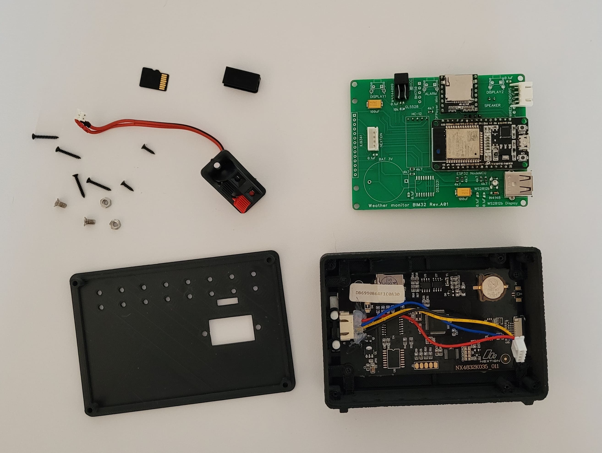
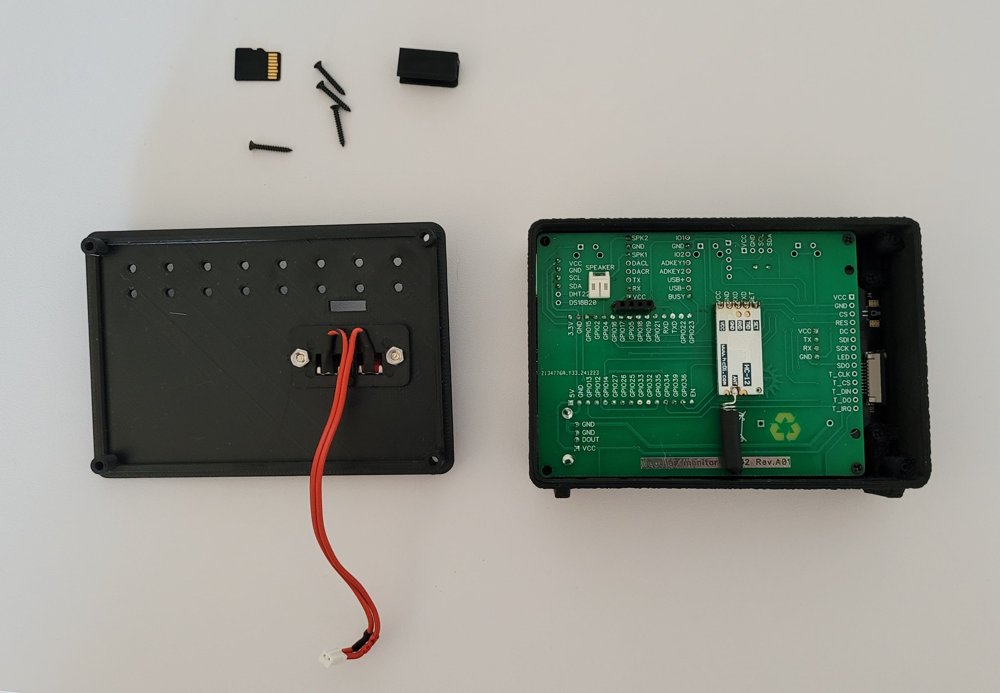

<a href="README.md"></a>
<a href="README_RU.md"></a> 

# Монитор погоды BIM32
## Монитор погоды на ESP32

<p align="center"></p> 

### Краткий список возможностей монитора погоды:

* Подключение к домашней WiFi сети 2.4 гГц
* Отображение текущей погоды и прогноза погоды на 3 дня
* Отображение почасового прогноза погоды до 5 дней
* Отображение истории погоды (почасово) на 1 день назад
* Построение графиков температуры, влажности, давления и вероятности осадков
* Отображение температуры, влажности уровня CO2 и качества воздуха в доме
* Управление погодой в доме (увлажнителем, осушителем, обогревателем, охладителем и очистителем воздуха)
* Часы (маленькие/большие/с секундами/стрелочные) с синхронизацией NTP
* Календарь с возможностью перелистывания до плюс/минус бесконечности
* Отправка и/или прием данных с/на сервис thingspeak
* Отправка данных на народный мониторинг
* До 2х беспроводных датчиков температуры/давления/влажности/CO2/освещенности/напряжения/тока/мощности/потребленной энергии
* Поддержка проводных датчиков температуры/давления/влажности/освещенности/качества воздуха
* Авторегулировка яркости подсветки экрана (по датчику освещенности, по времени или по факту рассвета и заката)
* Цветной сенсорный дисплей 3.5 или 3.2 дюйма
* Поддержка 6 языков: Английский, Немецкий, Русский, Польский, Украинский, Болгарский
* Дополнительный 7-сегментный цветной дисплей больших и даже огромных часов
* Говорящие часы
* Будильник воспроизводящий mp3 файлы
* Звуковое оповещение о выходе температуры, влажности, CO2 и качества воздуха за пределы комфорта
* Очень гибкие настройки через веб интерфейс


```diff 
    Внимание всем желающим добавить поддержку нужного вам датчика или дисплея. Есть три способа это сделать:
    1. Сделать самостоятельно, исходники ведь в свободном доступе
    2. Прислать мне нужный вам дитчик/дисплей
    3. Спонсировать добавление нужного вам датчика/дисплея
```


## Схема подключения базовых модулей монитора погоды
Для запуска и работы монитора погоды достаточно соединить **дисплей** с **ESP32**. Подключение всех остальных модулей является необязательным. 

Выкладываю вместо схем полурисунки-полуфотографии, чтоб было понятно и начинающим и даже непрофессионалам. Профессионалов прошу не расстраиваться, нормальные схемы тоже будут.

<p align="center"></p>

Можно применить расширенную версию **Nextion** дисплея **NX4832K035**, или базовую **NX4832T035**. В случае с базовой моделью вам не будут доступны часы с секундами, графики погоды и управление будильниками с экрана.

Альтернативно, можно применить дисплей ILI9341.

<p align="center"></p>

Если вдруг, кому нужно иметь под рукой кнопку включения/выключения дисплея, ее можно подключить по следующей схеме.

<p align="center"></p>

## Схема подключения проводных датчиков к монитору погоды
К **монитору погоды** можно подключить проводные датчики температуры, влажности, давления, качества воздуха и уровня освещенности. **Монитор** поддерживает следующие датчики: 
* BME280
* BME680
* BMP180
* SHT21
* DHT22
* DS18B20
* MAX44009
* BH1750
* фоторезистор

Можно подключить любой один, несколько, либо сразу все датчики из этого списка. Если ваш дисплей не **NX4832K035** рекомендуется установить микросхему часов реального вермени DS3231. Схема подключения следующая.

<p align="center"></p>

## Схема подключения модуля радиоканала для связи с беспроводными датчиками
Также, к **монитору погоды** можно подключить **[беспроводные датчики](https://github.com/himikat123/Radio-sensor)**, для этого нужно добавить модуль радиоканала **HC-12** по схеме приведенной ниже.

<p align="center"></p>

## Схема подключения приборов управления погодой в доме
Для управления погодой в доме можно подключить увлажнитель и осушитель воздуха, а также обогреватель, охладитель (вентилятор или кондиционер) и очиститель воздуха. Схему подключения этих приборов привести не могу, так как все зависит от того как реализовано управление в каждом конкретном приборе (пультом, кнопками, напряжением). Поэтому просто обозначу на каких выводах **PCF8574** появятся логические единицы когда нужно включить тот или иной прибор.

<p align="center"></p>

## Схема подключения модуля звука
Чтоб будильник и говорящие часы могли издавать звуки, применен модуль mp3-плеера **DF-Player mini**, схема подключения которого представлена ниже. Необходимо будет скопировать все содержимое папки **SDcard** на **micro-sd карту**, предварительно отформатировав ее в файловую систему FAT32. Если вам не нужен звук - соедините вывод GPIO18 ESP32 с землей.

<p align="center"></p>

Во время эксплуатации данного прибора был обнаружен неприятный момент, данный модуль mp3-плеера издает постоянный негромкий шум. Чтоб избавиться от шума, нужно перепаять резистор из положения А в положение Б, показанный на фото ниже. Данная манипуляция переключает вход MUTE усилителя на выход BUSY, на котором появляется лог. сигнал только во время воспроизведения звука.

<p align="center"></p>


## Схема монитора погоды

Ну и, как и обещал, нормальная общая схема для общего развития.
```diff 
- Обратите внимание, если вы решите не устанавливать кнопки 
- (включения/отключения дисплеев и отключения будильника), 
- подтягивающие резисторы этих кнопок все равно нужно установить.
```

<p align="center"></p>

## Прошивка монитора погоды

Для прошивки монитора погоды вам понадобится **micro-sd** карта, **micro-USB** кабель и компьютер.

Чтоб прошить **дисплей Nextion**, нужно скопировать файл прошивки дисплея (файл с названием модели вашего дисплея .tft) из папки **bin** на **micro-sd** карту (карта должна быть отформатирована в файловой системе **FAT32**). Затем вставить флешку в слот **micro-sd** дисплея и подать ему питание. Дисплей сам прошьется с флешки, прогресс прошивки будет отображен на экране.

Для прошивки **ESP32**:
1. Скачайте [flash_download_tools](https://www.google.ru/search?q=flash_download_tools)
2. Запустите его, выберите ESP32 DownloadTool
3. Выберите бинарные файлы прошивки (находятся в папке bin) и адреса как на скриншоте. И номер COM-порта
4. Нажмите кнопку Start в программе прошивки и кнопку Settings прибора (кнопка BOOT на модуле ESP32). Удерживайте кнопку Settings нажатой, пока не начнется процесс прошивки.

<p align="center"></p>

После прошивки **монитор погоды** нужно настроить. Ненастроенный прибор сам включает точку доступа (создает WiFi сеть) **BIM32** с паролем сети по умолчанию **1234567890**. А в дальнейшем, чтоб ее снова включить, нужно нажать и удерживать нажатой кнопку **Settings**, пока на экране вместо символа антенны не появится символ точки доступа. Подключив ноутбук, или телефон, к сети **BIM32**, нужно открыть браузер и перейти по адресу **http://192.168.4.1**. Введите логин **admin** и пароль **1111**, чтоб открыть страницу настроек. В дальнейшем, в целях безопасности, рекомендуется сменить логин и пароль по умолчанию.

<p align="center"></p>

Также, когда прибор уже настроен и подключен к сети, в настройки можно попасть и без нажатия кнопки **Settings**, достаточно ввести в браузере IP-адрес **монитора погоды**. Узнать этот адрес можно тапнув по символу антенны на экране **монитора погоды**.

<p align="center"></p><hr />

## Демо страницы настроек можно посмотреть <a href="https://himikat123.github.io/Web-Interface-BIM/" target="_blank">здесь</a>

## Фотки монитора погоды
Ну и в конце, традиционно, несколько фоток получившегося устройства. Корпус напечатан на 3д принтере, файлы для 3д печати вы найдете в папке **enclosure/STL/** 

<p align="center"></p>

<p align="center"></p>

<p align="center"></p>

<p align="center"></p>

<p align="center"></p>

<p align="center"></p>

<hr>


## Нравится проект? Купи мне кофе, или пиво.

<a href="https://www.buymeacoffee.com/himikat123Q">
    
</a>

<a href="https://www.paypal.com/donate/?hosted_button_id=R4QDCRKTC9QA6">
    
</a>