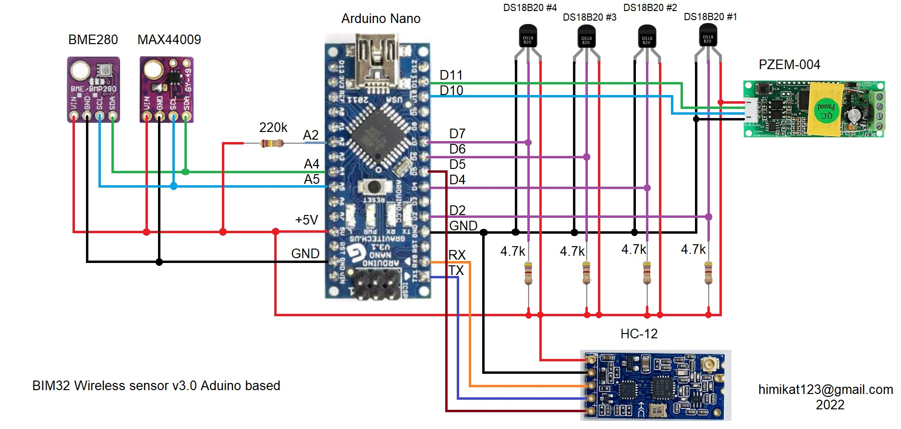
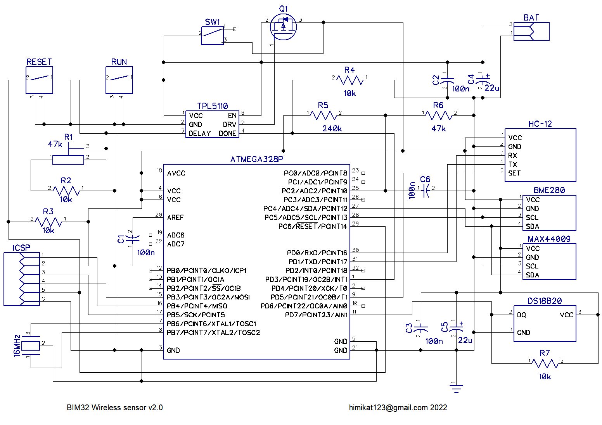
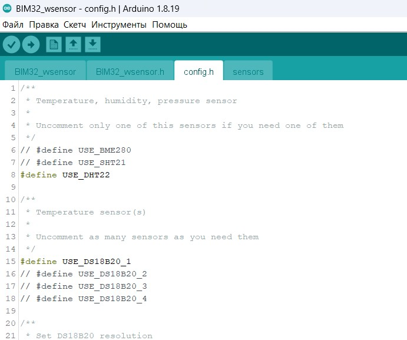

## Схема беспроводного датчика
Сам **беспроводной датчик** можно собрать на модуле **Arduino Nano**, или любом другом модуле построенном на **atmega328p**. В этом случае схема, сборка и прошивка **беспроводного датчика** будут максимально простыми, но в таком виде об автомном питании датчика можно забыть.

Или можно пойти более сложным путем, собрать **беспроводной датчик** из *рассыпухи* и прошить его программатором. В этом случае **беспроводной датчик** сможет прожить от трех пальчиковых батареек почти год.

## Прошивка беспроводного датчика
Чтоб прошить **беспроводной датчик** нужно открыть проект в Arduino IDE, перейти во вкладку **config.h** и раскомментировать (убрать символы **//** в начале строки) нужные датчики. Если у вас 2 беспроводных датчика - в конце этого файла в строчке **const int SENSOR_NUMBER = 0;** для первого датчика оставьте значение **0**, а для второго измените **0** на **1**.

Если ваш датчик собран на **Arduino модуле** то просто прошейте его как обычно. 

А если на ***рассыпухе*** - выберите в меню **Скетч** -> **Экспорт бинарного файла**. 

После компиляции в папке проекта появятся два **.hex** файла, вам нужен **BIM32_wsensor.ino.eightanaloginputs.hex**, его и нужно зашить в **atmega328p** при помощи программатора. Фьюзы выставьте как на скрине ниже.

