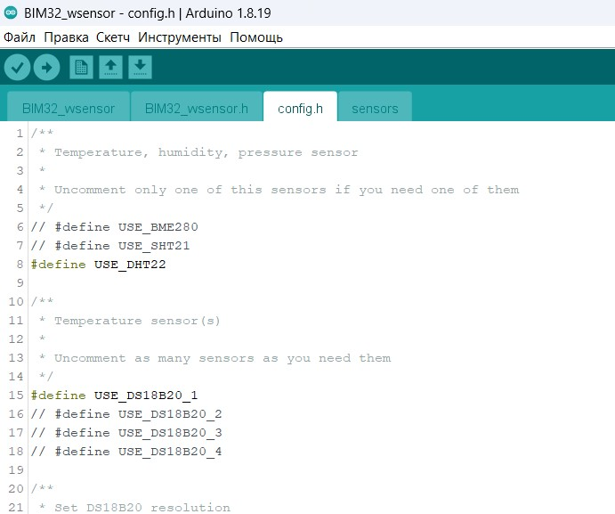
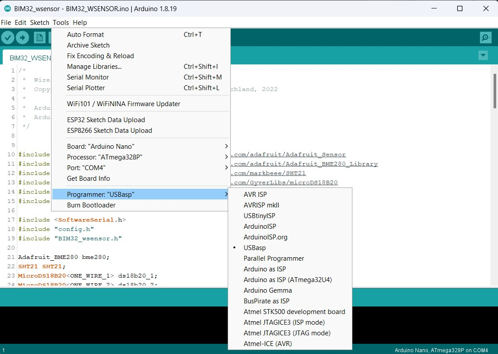
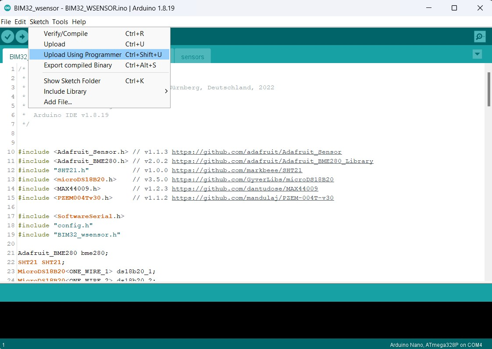
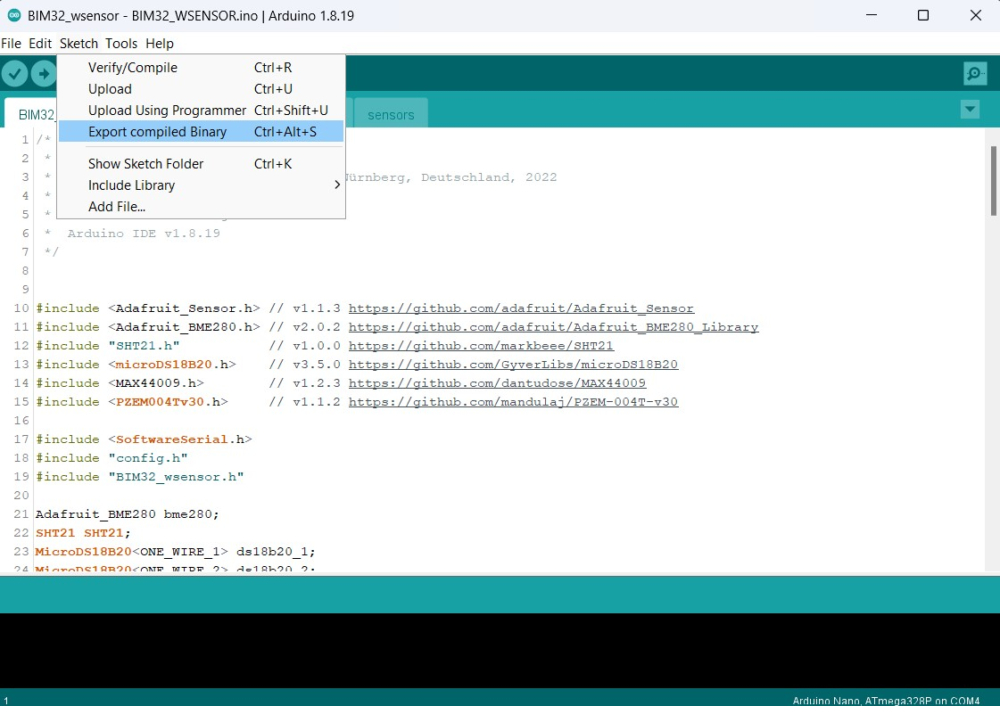

# Wireless sensor

## Wireless sensor schematic diagramm
The **wireless sensor** itself can be assembled on the **Arduino Nano** module, or any other module built on the **atmega328p**. In this case, the circuit, assembly and flashing of the **wireless sensor** will be as simple as possible, but in this form you can forget about the autonomous power supply of the sensor.

Or you can go a more complicated way, assemble the **wireless sensor** from *SMD-components* and flash it with a programmer. In this case, the **wireless sensor** will be able to live from three AA batteries for almost a year.

## Wireless sensor firmware
To flash the **wireless sensor** you need to open the project in the Arduino IDE, go to the **config.h** tab and uncomment (remove the characters **//** at the beginning of the line) the necessary sensors. If you have 2 wireless sensors - at the end of this file in the line **const int SENSOR_NUMBER = 0;** for the first sensor leave the value **0**, and for the second change **0** to **1**.

If your sensor is built on **Arduino module** then just flash it as usual.

And if on ***SMD-components*** - select in the Arduino IDE **Tools** -> **Programmer** -> **Your type of programmer**

Then click on the menu **Sketch** -> **Download via programmer**

If Ardino does not have your programmer, select **Sketch** -> **Export binary file** from the menu.

After compilation, two **.hex** files will appear in the project folder, you need **BIM32_wsensor.ino.eightanaloginputs.hex**, and you need to flash it into **atmega328p** using a programmer. Set the fuses as in the screenshot below.

